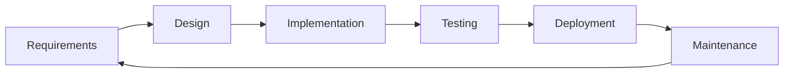
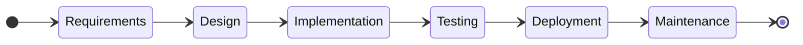
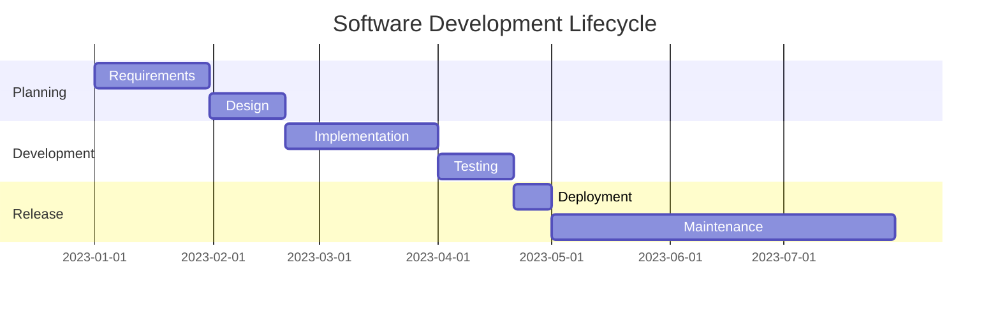
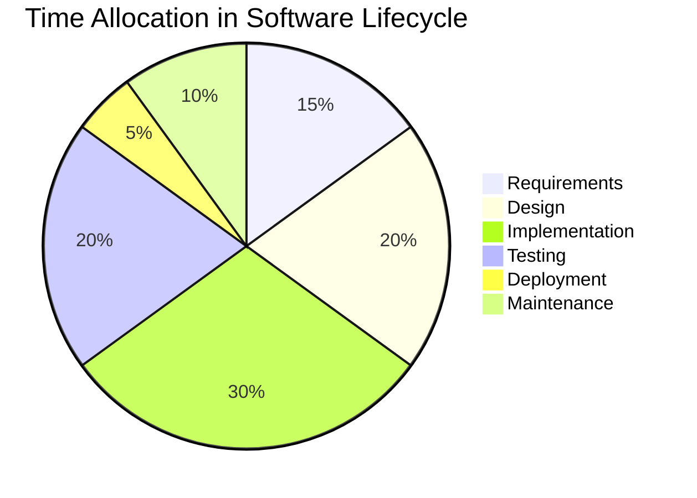
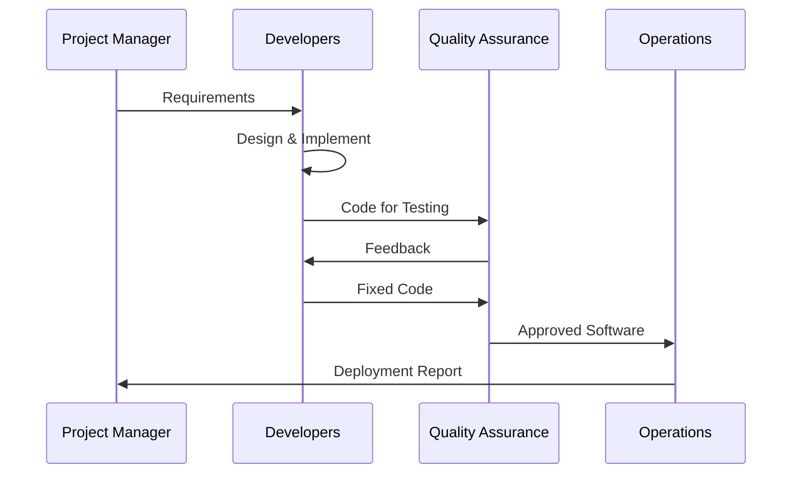

Here is a list of several options of graphs to use in mermaid

## Flowchart

```
graph TD
    A[Requirements] --> B[Design]
    B --> C[Implementation]
    C --> D[Testing]
    D --> E[Deployment]
    E --> F[Maintenance]
    F --> A
```



## State Diagram

```
stateDiagram-v2
    direction LR
    [*] --> Requirements
    Requirements --> Design
    Design --> Implementation
    Implementation --> Testing
    Testing --> Deployment
    Deployment --> Maintenance
    Maintenance --> [*]
```



## Grantt Chart

```
gantt
    title Software Development Lifecycle
    dateFormat  YYYY-MM-DD
    section Planning
    Requirements       :a1, 2023-01-01, 30d
    Design             :after a1, 20d
    section Development
    Implementation     :2023-02-20, 40d
    Testing            :2023-04-01, 20d
    section Release
    Deployment         :2023-04-21, 10d
    Maintenance        :2023-05-01, 90d
```



## Pie Chart

```
pie title Time Allocation in Software Lifecycle
    "Requirements" : 15
    "Design" : 20
    "Implementation" : 30
    "Testing" : 20
    "Deployment" : 5
    "Maintenance" : 10
```



## Sequence Diagram

```
sequenceDiagram
    participant PM as Project Manager
    participant Dev as Developers
    participant QA as Quality Assurance
    participant Ops as Operations

    PM->>Dev: Requirements
    Dev->>Dev: Design & Implement
    Dev->>QA: Code for Testing
    QA->>Dev: Feedback
    Dev->>QA: Fixed Code
    QA->>Ops: Approved Software
    Ops->>PM: Deployment Report
```


