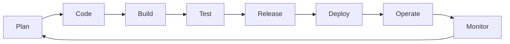

## What is DevOps ?

This is a set of best practices created to align the goals of Dev engineers with Ops engineers. Typically devs want to build and release fast, this can be problematic for ops engineers as their main objective is to make sure every deployment is secure, stable and won't cause any troubles in production. In the software lifecycle we can see these tasks more clearly.

## Software lifecycle 

## Problems with traditional development practices

Waterfall development projects
: Dev phases are siloed, each starting after the previous phrase has ended. 
: Testing and Security come after implementation, making corrective actions responsive and expensive. 

Monolithic applications
: Everything has to be deployed as a unit. The entire application must be redeployed everytime a new change is made. 
: Are hard to mantain and understand.

## DevOps culture

Here are five principles that are generally considered to be crucial:

Collaboration and Communication
: This is the foundation of DevOps. The idea is to create a culture of shared responsibility, faster problem-solving, and more efficient delivery of value to customers.
Automation
: It is important to automate as much as possible to reduce human error, increase efficiency, and allow teams to focus on activities that can generate more value. 
Continuous Integration and Continuous Delivery (CI/CD)
: These ensures that code changes are regulary integrated, tested and deployed to production at any time. 
Infrastructure as Code (IaC)
: This allows for version control, automation and consistency across different environments. This greatly enhances reproducibility and scalability. 
Monitoring and Feedback
: Implementing comprehensive monitoring, logging and feedback systems provides visibility into application and infrastructure performance. This enables teams to quickly identify and resolve issues. 

